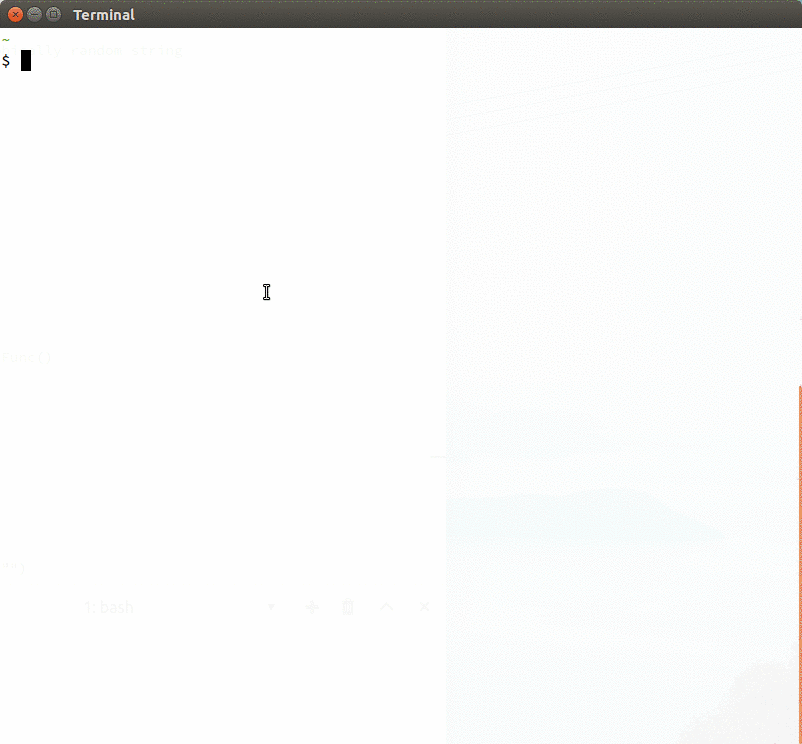

**kb** is small a command line password manager.


#### How it works

It encrypts passwords with your keybase public key using the [keybase
cli](https://keybase.io/docs/command_line), saving the ciphertext in `$HOME/.kb/<key>`.

#### Installation
Install [keybase](https://keybase.io/) and [go](https://golang.org/doc/install). Then,
```
go get github.com/kingishb/kb
kb init
```